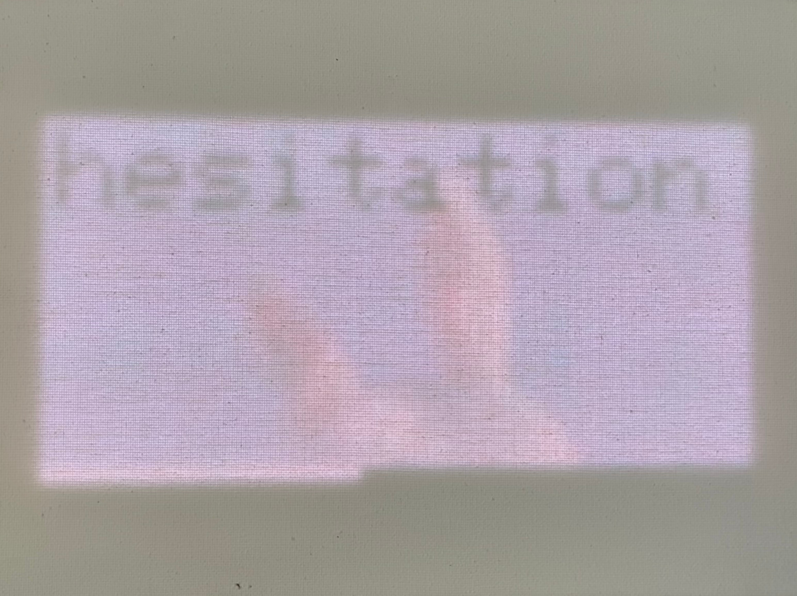

# MatrixPortal Spotify Display

This arduino sketch implements support for displaying the album art of the active track in spotify
when listening to music. It has been tested on an ESP32-S3 Matrix Board, with a 64x32 LED matrix display.

## Project Setup

The following components are needed:
- [ESP32-S3 Matrix Board](https://www.adafruit.com/product/5778)
- [64x32 LED Matrix Display](https://www.adafruit.com/product/2278)
- Spotify account with developer access enabled

In order to utilize the spotify API, you must generate a spotify refresh token,
which needs the `user-read-currently-playing` scope. This and other API secrets
must be placed in a file `app_secrets.h`, following the format of
`app_secrets.h.example`. For more details, see the `app_secrets.h.example` file.

Once the app secrets have been added, the project can be compiled and flashed onto
a ESP32-S3 matrix board mounted to a LED matrix display

## Results

Album art looks similar to this- I have mounted my LED display to a white canvas to
act as a diffuser.

## License

This program is licensed as Apache 2.0. For more details, please see `LICENSE`
